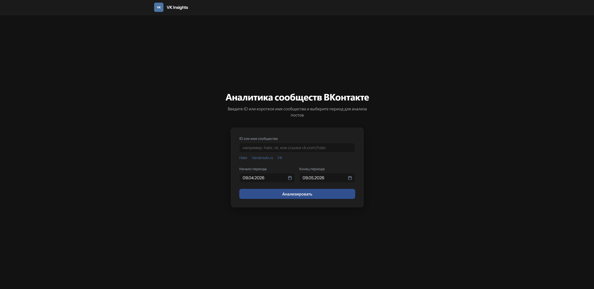
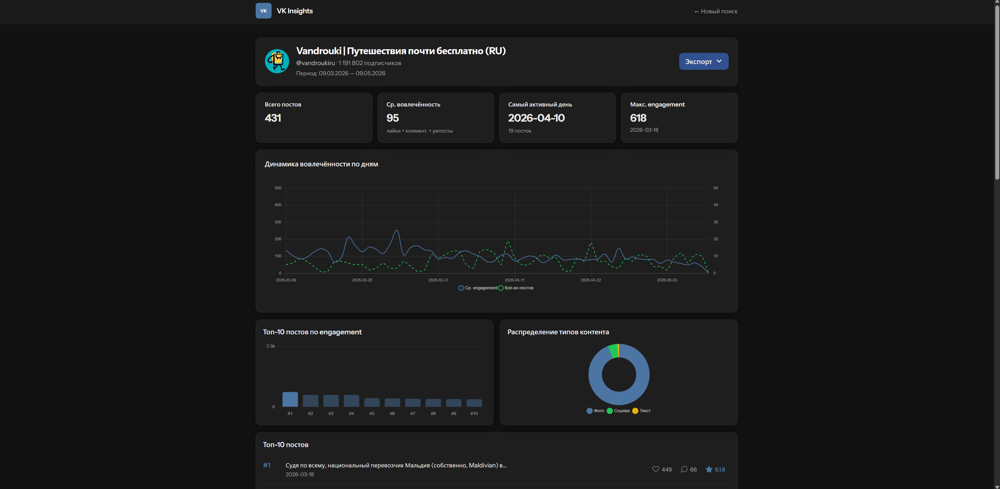
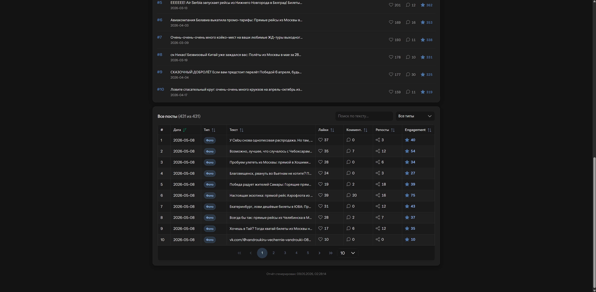

# VK Insights

## О проекте

Дашборд по стене VK за период: `wall.get` / `groups.getById`. **Пустой `VK_SERVICE_TOKEN`** → всегда мок (в отчёте и UI текст об этом). **С токеном:** `VK_USE_MOCK=true` → мок; `VK_USE_MOCK=false` или не задано → live. Экспорт CSV/JSON. ТЗ: [docs/tz.md](./docs/tz.md).

## Плюсы

- Быстрый старт: `docker compose up --build` или `composer install` + `npm install` + serve (см. ниже).
- PHPUnit (сервисы, CSV, HttpVkClient) + опционально live; Vitest — `resources/js/api/report/*.test.js`.
- `VkClient`, `DashboardFixtureFactory` → один код для мок/live; DTO `app/Data`; VK в `app/Integration/Vk`.
- Кэш стены, `throttle`, CSV stream, `composer phpstan`.
- Доки: `docs/` (tz, IMPLEMENTATION, PERF).

## Запуск

### Docker

```bash
docker compose up --build
```

URL: **http://localhost:8080** (8080→8000 в контейнере). PHP 8.4, `public/build` из образа, Redis, тома `database/`, `storage/`. Нет `.env` — [`docker/entrypoint.sh`](./docker/entrypoint.sh) копирует [`.env.example`](./.env.example): пример с токеном = live; **без токена** приложение уйдёт в мок. Опционально: `./.env:/var/www/html/.env:ro`.

Подробнее: [docs/IMPLEMENTATION.md](./docs/IMPLEMENTATION.md#docker).

### Локально

`composer install` → `.env.example` → `.env`, `php artisan key:generate` → `npm install` → `npm run dev` + `php artisan serve` (`public/`). Сборка: `npm run build`. Deep link: `/?group=…&from=YYYY-MM-DD&to=YYYY-MM-DD`. Порт занят: `php -S 127.0.0.1:8090 -t public`.

## Стек / доки

Laravel 13, PHP 8.4, Vue 3, Vite, PrimeVue, Chart.js; только `routes/web.php` (CSRF на POST).

[docs/IMPLEMENTATION.md](./docs/IMPLEMENTATION.md) — дерево, команды, API, VK, Docker, env.  
[docs/PERF.md](./docs/PERF.md) — Lighthouse.

## Скриншоты

Стартовый экран



Дашборд (KPI, графики)



Топ посты и «Все посты»


