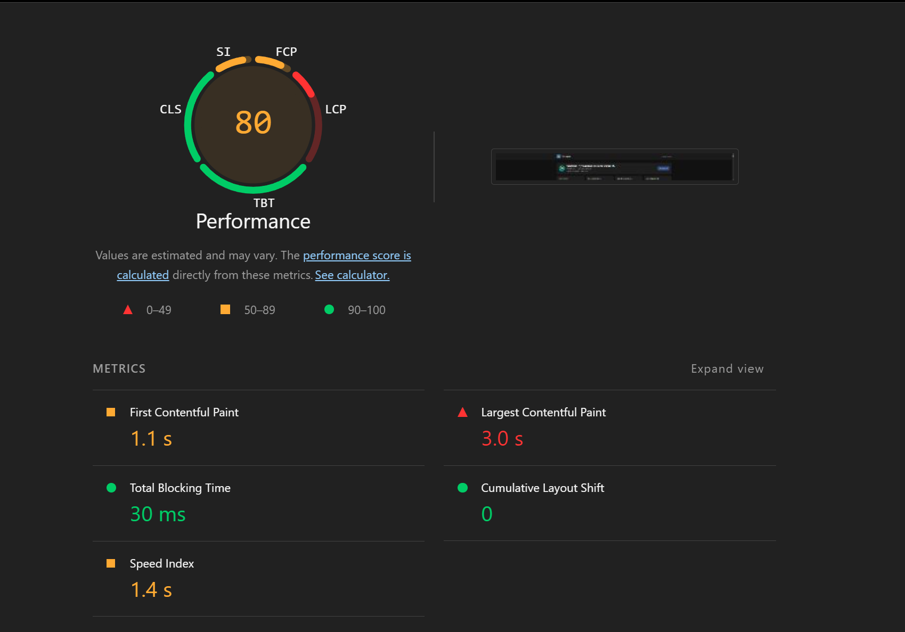

# Оптимизация фронтенда

Формат по мере появления замеров: **контекст → метрики → выводы**. Сборка для продакшена: `npm run build` из корня репозитория; Lighthouse — в Chrome DevTools, режим **Mobile** (или как в отчёте), без throttling, если не указано иначе.

## Замер 1 — после первой рабочей версии приложения

Первый прогон Lighthouse по уже собранному фронту и поднятому приложению.

| Метрика | Значение | Оценка в отчёте |
|---------|----------|-----------------|
| **Performance (общий балл)** | **80** | «требует улучшения» (оранжевый диапазон 50–89) |
| **LCP** (Largest Contentful Paint) | **3,0 с** | красная зона — основной вклад в просадку балла |
| **FCP** (First Contentful Paint) | **1,1 с** | оранжевая зона |
| **Speed Index** | **1,4 с** | оранжевая зона |
| **TBT** (Total Blocking Time) | **30 ms** | зелёная зона |

**LCP** — узкое место: крупный контент (типично герой/заголовок или крупный блок первого экрана) появляется поздно относительно порога «хорошо» для мобильного профиля Lighthouse.

**TBT** в этом замере выглядит очень хорошо отчасти потому, что измерение шло **поверх уже прогретого, кэшированного бэкенда**: меньше задержек на сеть и ожидание ответа сервера, меньше блокировки главного потока из‑за долгих задач после ответа. На «холодном» API и медленной сети TBT может быть выше — это стоит иметь в виду при следующих прогонах.

Дальнейшие пункты документа (до/после, конкретные правки в коде) можно добавлять сюда же по мере новых замеров.
