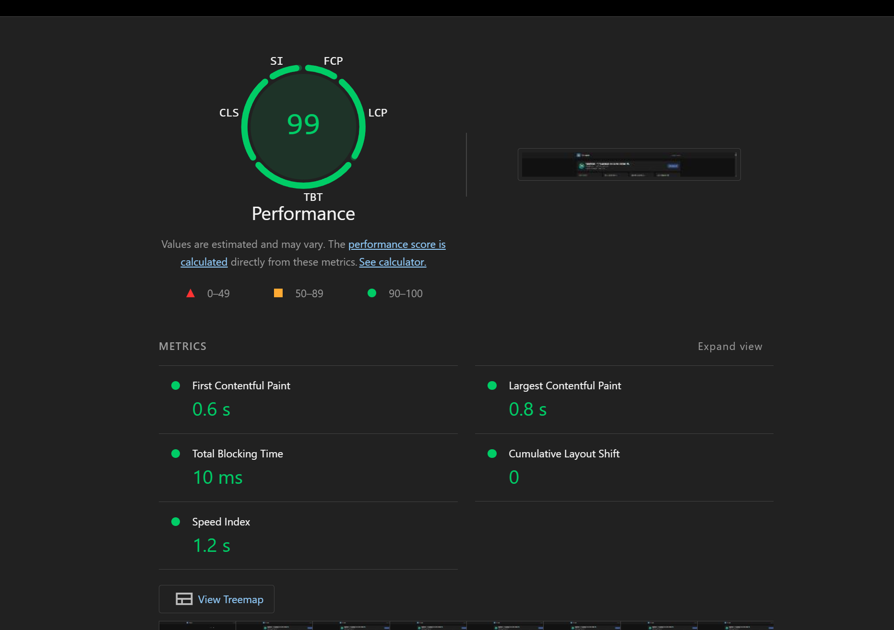

# PERF

Lighthouse, production-сборка (`npm run build`), поднятое приложение; профиль как в отчёте (обычно Mobile).

## Замер 1 (до правок)

| Метрика | Значение | Lighthouse |
|---------|----------|------------|
| Performance | 80 | 50–89 |
| LCP | 3,0 s | fail |
| FCP | 1,1 s | 50–89 |
| Speed Index | 1,4 s | 50–89 |
| TBT | 30 ms | pass |

**LCP:** hero первого экрана только после JS/CSS Vite. **TBT:** замер с прогретым кэшем бэкенда.

## Замер 2 (после правок)

| Метрика | Значение |
|---------|----------|
| Performance | **99** |
| LCP | **0,8 s** |
| FCP | **0,6 s** |
| Speed Index | **1,2 s** |
| TBT | **10 ms** |
| CLS | **0** |

### Что сделано (`resources/views/app.blade.php`)

1. **Шрифт Bunny** — `display=swap`, загрузка без блокировки рендера: `media="print" onload="this.media='all'"`, `<noscript>` fallback.
2. **Inline critical CSS** — фон, тёмная тема, отступы и типографика hero до прихода бандла Vite (system-ui до webfont).
3. **Статический скелет в `#app`** — шапка «VK Insights» + тот же h1/подзаголовок, что на стартовом экране Vue; LCP успевает по тексту до монтирования приложения.
