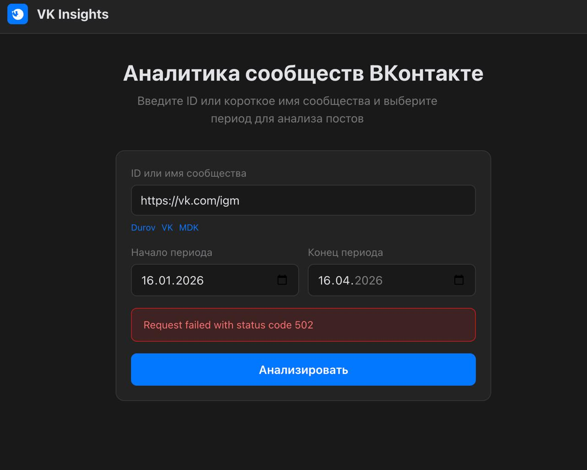
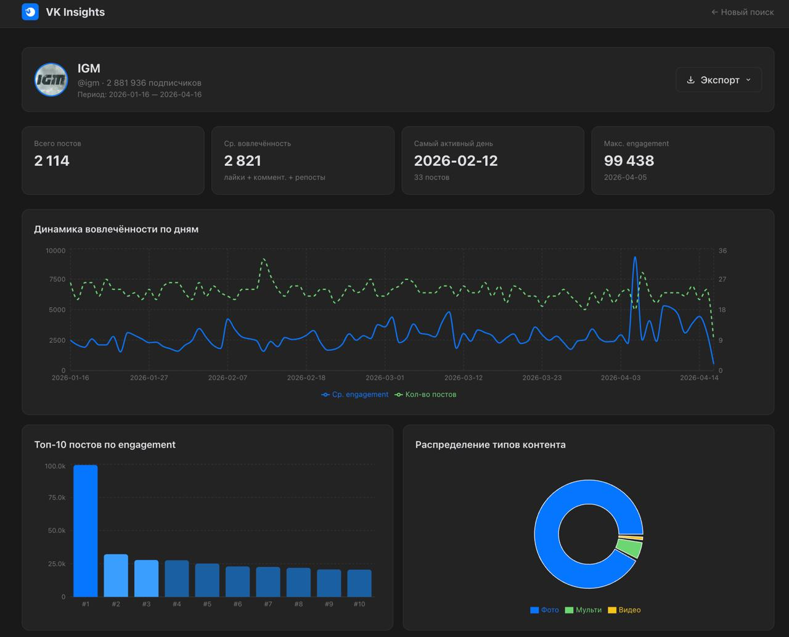
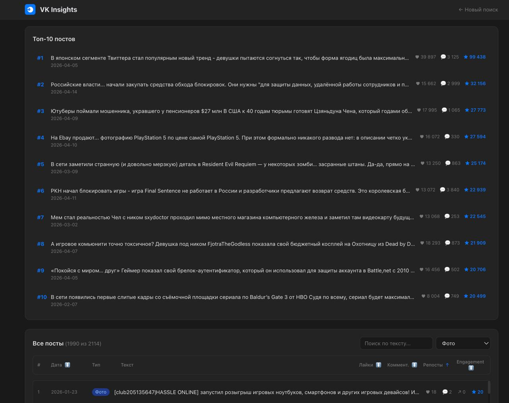
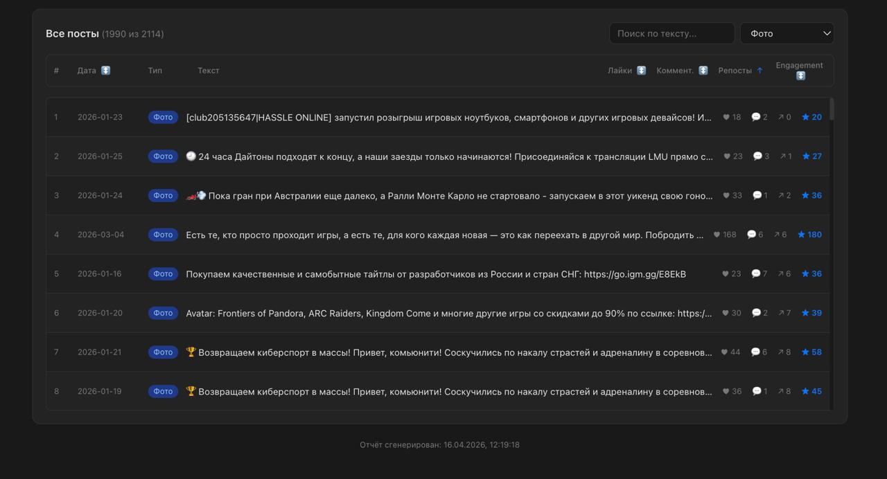
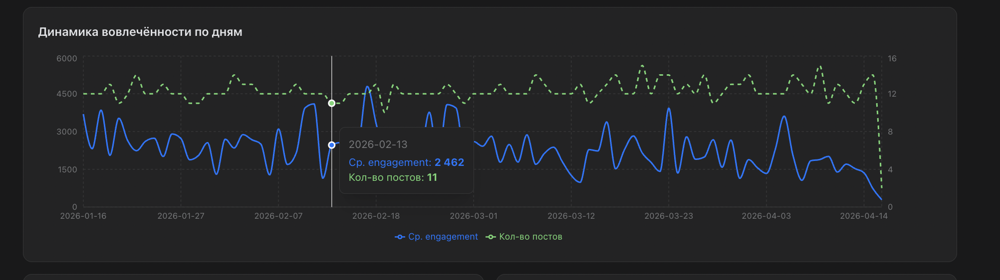

# Тестовое задание — Middle Fullstack Developer

## VK Community Insights Dashboard

Реализуй мини-приложение, в котором пользователь вводит ссылку или ID сообщества ВКонтакте и получает аналитический дашборд по постам за выбранный период.

---

## Что должно уметь приложение

- По `group_id` и периоду загружать посты через VK API (`wall.get`, `groups.getById`)
- Отображать:
  - топ постов по вовлечённости (лайки + комментарии + репосты)
  - среднюю вовлечённость за период
  - распределение постов по типам (текст / фото / видео / ссылки)
  - динамику активности по дням
- Экспортировать отчёт в CSV и JSON
- Кэшировать результаты, чтобы не дёргать VK API при повторном запросе

---

## Требования

### Backend

- REST API:
  - `POST /analyze` — запуск / обновление анализа
  - `GET /report/:groupId?from=...&to=...` — получение отчёта
  - `GET /health` — статус сервиса
- Кэш на 10–30 минут (in-memory или Redis — на выбор)
- Корректная обработка ошибок VK API (лимиты, 429, недоступность)
- Логирование времени ответа и количества запросов к VK API

### Frontend

- Экран ввода сообщества и периода
- Дашборд с таблицей и минимум одним графиком
- Состояния: загрузка / пусто / ошибка
- Адаптивная вёрстка

### Оптимизация — обязательный блок

Нужно **доказать** оптимизацию. Конкретно:

- До / после метрики — Lighthouse или Web Vitals
- Что было сделано (минимум 2–3 пункта):

Всё это оформить в файл `PERF.md` в формате: **проблема → решение → измеримый эффект**.

---

## Стек

Выбирай любой, который считаешь подходящим. Рекомендуется:

- **Backend:** Node.js или Python, любой фреймворк
- **Frontend:** React / Vue / Svelte — на выбор

Если используешь нестандартный стек — кратко объясни выбор в README.

---

## Что нужно сдать

1. **Репозиторий** (GitHub / GitLab) с историей коммитов
2. **README** — как запустить локально, где взять и как подключить VK-токен
3. **PERF.md** — описание оптимизаций с метриками до / после
4. **Видео или GIF до 3 минут** — демонстрация работающего приложения (опционально, но приветствуется)

---

## Критерии оценки

| Блок                   | Вес | На что смотрим                                                                 |
| ---------------------- | --- | ------------------------------------------------------------------------------ |
| Работа с VK API        | 35% | Корректность запросов, пагинация, обработка лимитов и ошибок, стабильность     |
| Проектирование backend | 25% | Структура кода, кэш, понятные эндпоинты, чистота реализации                    |
| Frontend UX            | 20% | Удобство, обработка состояний (loading / error / empty), читаемость интерфейса |
| Оптимизация            | 20% | Измеримый результат и аргументация в PERF.md                  |

---

## Сроки

1–2 рабочих дня.

Если что-то не успеваешь — лучше сделать меньше, но качественно. Приоритет: работающий VK API + кэш + базовый дашборд. Оптимизации — вторым слоем.

---

## Как получить VK Service Token

1. Зайди на [dev.vk.com](https://dev.vk.com/ru) → **Создать приложение** → тип **Standalone**
2. В настройках приложения скопируй **Сервисный ключ доступа**
3. Положи его в `.env` как `VK_SERVICE_TOKEN=...`

Сервисный токен даёт доступ к публичным данным без авторизации пользователя — этого достаточно для задания.

---

## Скриншоты

### Главный экран

### Ошибка запроса

### Ошибка запроса 2

### Дашборд

### Топ постов и таблица

### Таблица постов

### Графики вовлечённости и типов контента

### График динамики вовлечённости

